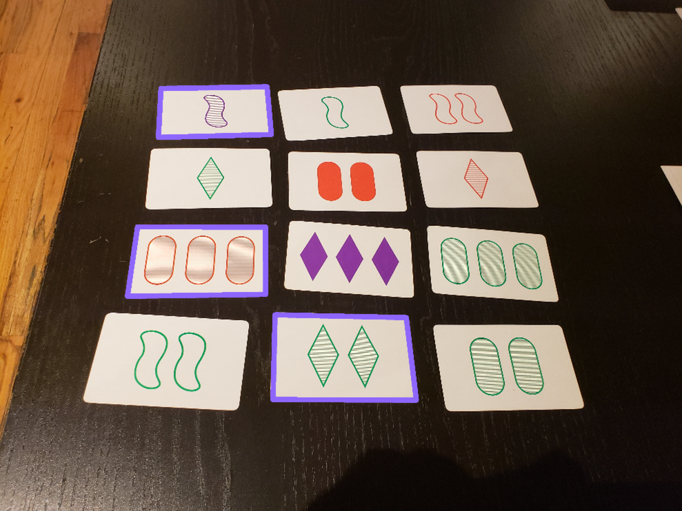

# set-solver
Solve the SET card game using OpenCV. Image of a game of set -> same image with labeled sets. Under construction.



## Setup

### 1. Install OpenCV

Mac: [Use this guide](https://www.pyimagesearch.com/2016/12/19/install-opencv-3-on-macos-with-homebrew-the-easy-way/)

Linux: \#TODO

### 2. Install python libraries: 

```
#TODO
```

### 3. Solve SET!

```
./solve_set.py <game_image_file>
```

## Files

* `image-data/` - All image data, including raw game images, labeled card images.
* `vendor/` - where the [Noteshrink](https://mzucker.github.io/2016/09/20/noteshrink.html) code (for color bucketing) lives.
* `avg_colors.py` - Single use script to get the average shape color values from each of the red, green, purple images.
* `card_finder.py` - Given a game image, outputs images of all cards found.
* `classes.py` - Classes representing set games and cards.
* `classify_card.py` - Given a card image, outputs the best guess of what card it is.
* `classify_card_accuracy.py` - Rate how well `classify_card.py` does against a directory of labeled card files.
* `common.py` - Common constants or functions shared between scripts.
* `cv2_diff.py` - The same functionality as [diffimg](https://github.com/nicolashahn/diffimg), but implemented using `cv2` instead of `PIL`. Gives different ratios and I still need to investigate why. Also runs much slower.
* `process_card.py` - Process a card image so that it's more easily classified by `classify_card.py`.
* `extract_shapes.py` - Cut out one to three shapes from a card image.
* `label_all_cards.py` - Single use script to easily label cards.
* `solve_set.py` - Script that runs the whole pipeline - takes in a game image file and displays that image with the sets overlaid.
* `test.py` - Tests are life.

## Tasks

- [ ] Make `card_finder.py` more reliable - sometimes drops a card
- [x] Increase card classification accuracy
  - [x] Bucket colors - https://mzucker.github.io/2016/09/20/noteshrink.html
    - [x] Generate bucketed+labeled card set
    - [x] Bucket colors in the unclassified card before comparing against the bucketed+labeled cards
  - [x] Find a reliable way to choose shade (solid/stripes/outline)
    - [ ] Accuracy here can still be improved
  - [ ] "Shove a neural net into it" - optional if OpenCV isn't enough (probably not necessary)
    - [ ] I don't want to take hundreds of pictures of cards, so maybe fake a training set? Take the same image and artificially introduce jitter in a variety of ways (position, skew, rotation, white balance, lighting, etc) that mimics the real differences we'd get
- [x] Solve SET once the image's card's labels are in memory
   - [x] Brute force it first
   - [ ] Better than brute force? Might be interesting to think about if SET's # cards on table, # attributes, # categories per attribute were increased
- [x] Get the pipeline smoothed out. Input is a game image, output is the sets overlayed
  - [x] Write outlines of sets onto original image
  - [ ] E2E test for entire pipeline
  - [ ] More tests in general
- [ ] Make it run on a phone
  - [ ] React Native app that sends an image to a Flask app?
  - [ ] Have the whole pipeline run on the phone? Going to require an entire rewrite of the pipeline
